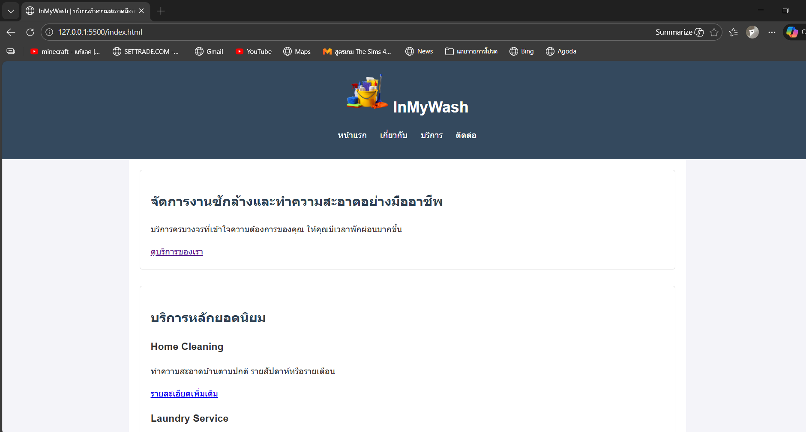
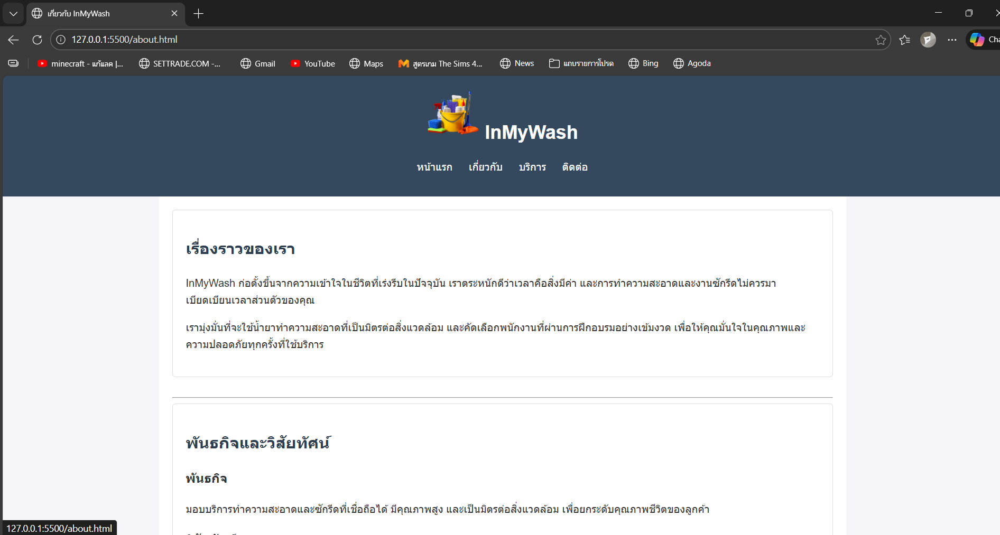
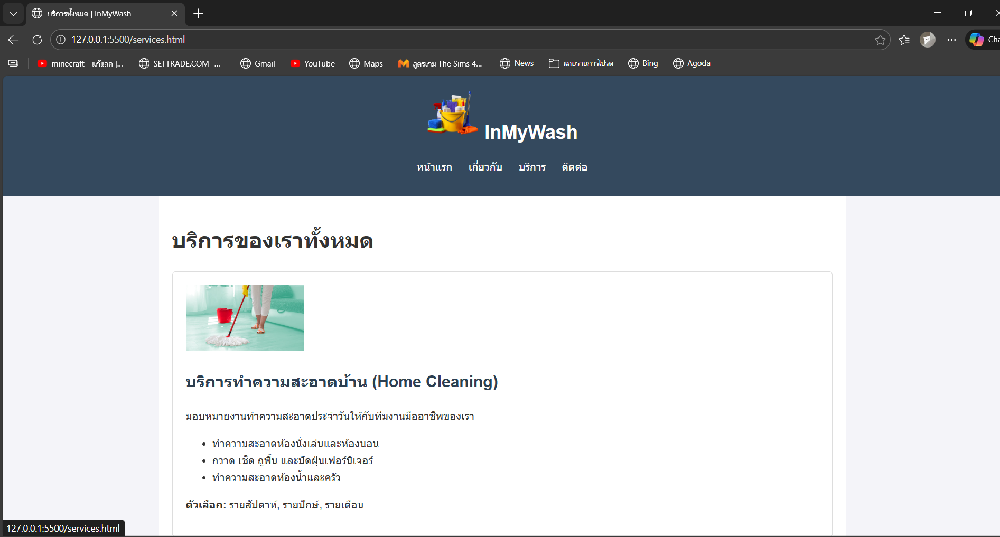
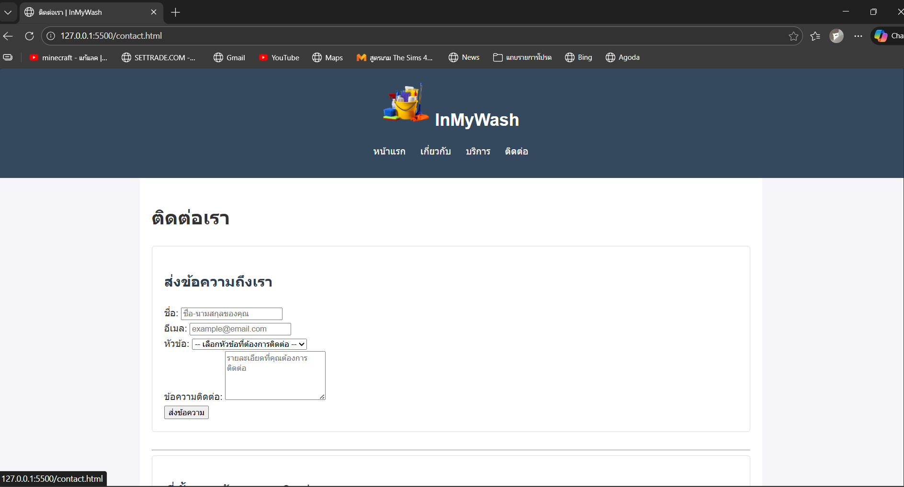

# InMyWash: บริการทำความสะอาดมืออาชีพ (My-Business-Web)

## ชื่อและคำอธิบายโปรเจค

**ชื่อโปรเจค:** InMyWash: บริการทำความสะอาดและซักรีดแบบครบวงจร
**คำอธิบาย:** โปรเจคนี้คือการพัฒนาเว็บไซต์สำหรับธุรกิจบริการทำความสะอาด โดยจัดทำขึ้นเพื่อส่งมอบงาน Assignment #1 แสดงให้เห็นถึงการใช้ Semantic HTML

## โครงสร้างไฟล์

my-business-web/
├── index.html (หน้าแรก)
├── about.html (เกี่ยวกับ)
├── services.html (บริการ)
├── contact.html (ติดต่อ)
├── styles.css (ไฟล์ CSS สำหรับจัดรูปแบบ)
├── README.md  
└── images/  
 ├── logo.png  
 ├── team-member-1.jpg
└── ... (ไฟล์รูปภาพอื่นๆ)

## รูปหน้าจอทั้งหมด

## ลิงก์เข้าไปในแต่ละหน้า

| ชื่อหน้า  | ลิงก์                               |
| :-------- | :---------------------------------- |
| หน้าแรก   | http://127.0.0.1:5500/index.html    |
| เกี่ยวกับ | http://127.0.0.1:5500/about.html    |
| บริการ    | http://127.0.0.1:5500/services.html |
| ติดต่อ    | http://127.0.0.1:5500/contact.html  |
